# Screenshots Documentation

## Before @Mention Feature Implementation

These screenshots show the three chat applications **before** the @mention feature was added:

### Vanilla Chat (Before)
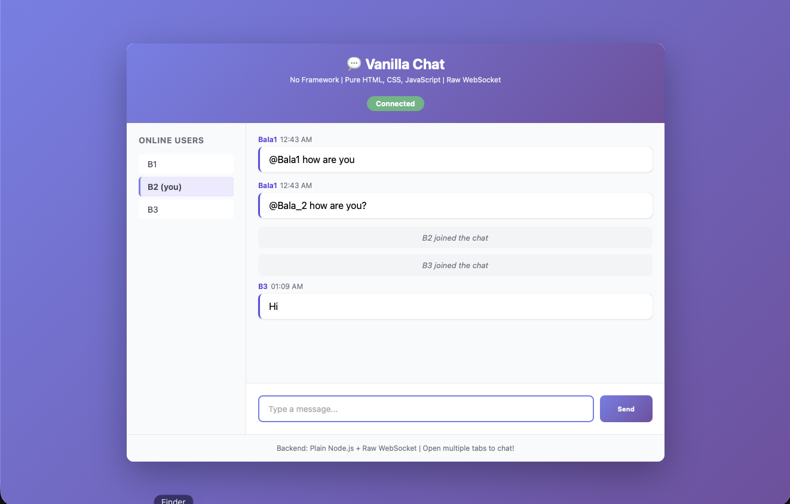
- **Notice:** `@Bala1` and `@Bala_2` are just plain text
- No highlighting or special styling
- No indication when you're mentioned

### React Chat (Before)
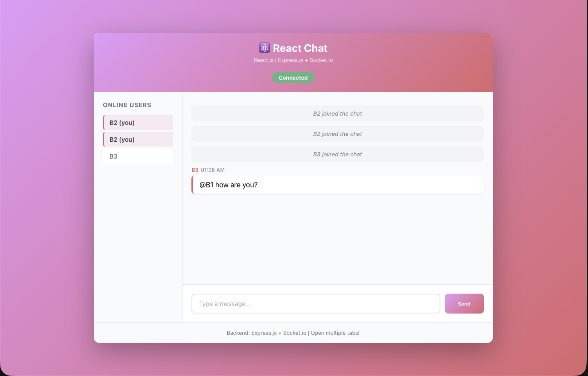
- **Notice:** @mentions are just regular text
- No visual feedback for mentions
- No badge or notification

### Angular Chat (Before)
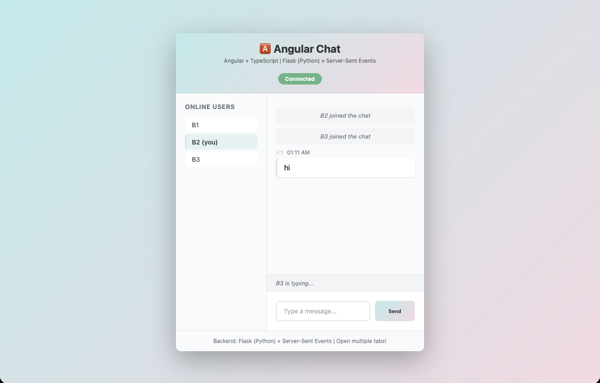
- **Notice:** @mentions not distinguished from normal text
- No special treatment for mentioned users

---

## After @Mention Feature Implementation

### Vanilla Chat (After) - @Mention Highlighting ✅

**Features Demonstrated:**
1. ✅ **@mention highlighting** - `@B1` appears in blue boxes
2. ✅ **Mentioned messages** - Yellow background on messages mentioning B1
3. ✅ **"@ mentioned you" badge** - Orange badge with pulse animation
4. ✅ **Multiple mentions** - Two different users (B2 and B3) mentioned B1

**What Changed:**
- BEFORE: `@B1` was plain text, easy to miss
- AFTER: `@B1` is blue, message is yellow, orange badge pulses - impossible to miss!

---

## Private Direct Messaging Feature 📩

### Complete Flow Demonstration

**Scenario:** B3 sends `@B1 Testing Private Message`

#### 1️⃣ Sender's View (B3)
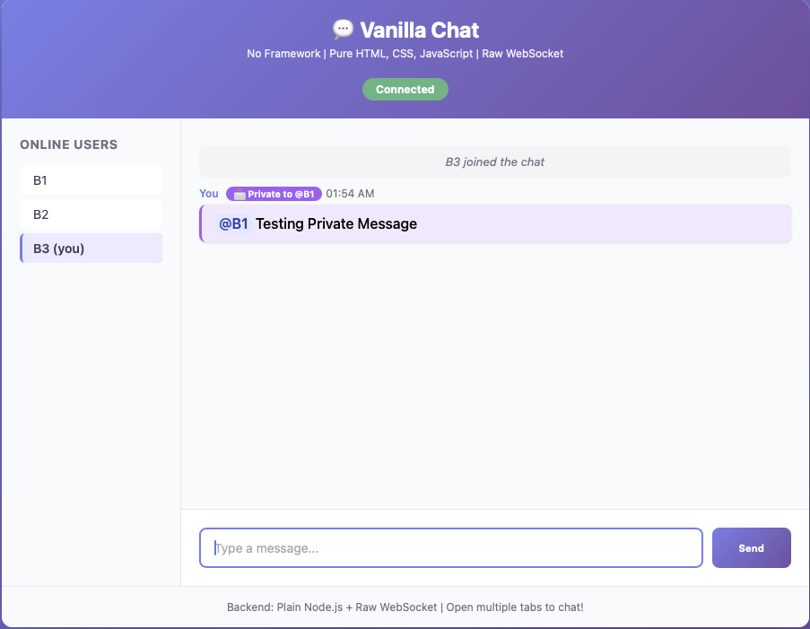
- ✅ Purple background (#f3e8ff)
- ✅ Purple border (#a855f7)
- ✅ **"📩 Private to @B1"** badge
- ✅ Shows "You" as sender
- ✅ @B1 highlighted in blue

**What this means:** B3 knows the message was sent privately to B1

---

#### 2️⃣ Recipient's View (B1)
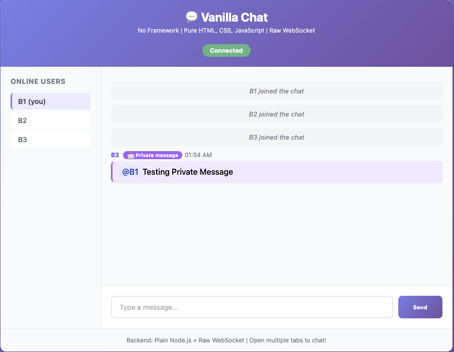
- ✅ Purple background (different from yellow mentions)
- ✅ **"📩 Private message"** badge
- ✅ Shows sender's name "B3"
- ✅ @B1 highlighted in blue

**What this means:** B1 knows this is a private message, not public

---

#### 3️⃣ Observer's View (B2)
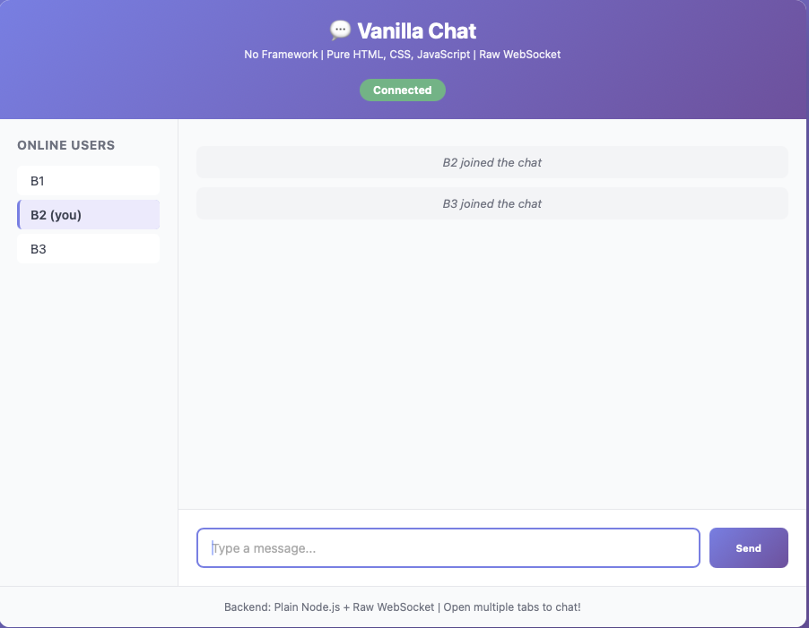
- ✅ **Message is completely invisible to B2**
- ✅ Only sees system notifications (B2/B3 joined)
- ✅ Chat area is empty (no private message visible)

**What this means:** Privacy is maintained - only sender and recipient see the message!

---

### Private Message vs Public Mention

| Feature | Private Message | Public Mention |
|---------|----------------|----------------|
| **Trigger** | `@B1 hello` (@ at start) | `Hello @B1` (@ in middle) |
| **Who sees it** | Only B1 and sender | Everyone |
| **Background** | Purple (#f3e8ff) | Yellow (#fef3c7) for mentioned user |
| **Badge** | 📩 Private message / Private to @B1 | @ mentioned you |
| **Use case** | Confidential messages | Getting someone's attention |

---

## React Private Messaging Implementation 📩⚛️

**Scenario:** B3 sends `@B1 hi` as a private message in React Chat

### 1️⃣ React - Sender's View (B3)
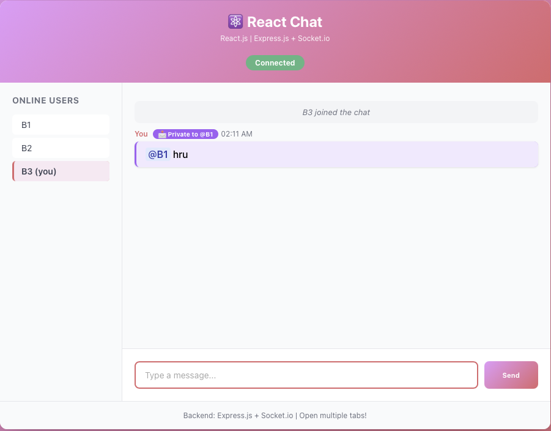
- ✅ Purple background (same as Vanilla for consistency)
- ✅ **"📩 Private to @B1"** badge
- ✅ Shows "You" as sender
- ✅ JSX conditional rendering makes this code MUCH cleaner!

**Code Comparison:**
- Vanilla: `createElement()` + `appendChild()` (imperative)
- React: `{isDM && ...}` (declarative)

---

### 2️⃣ React - Recipient's View (B1)
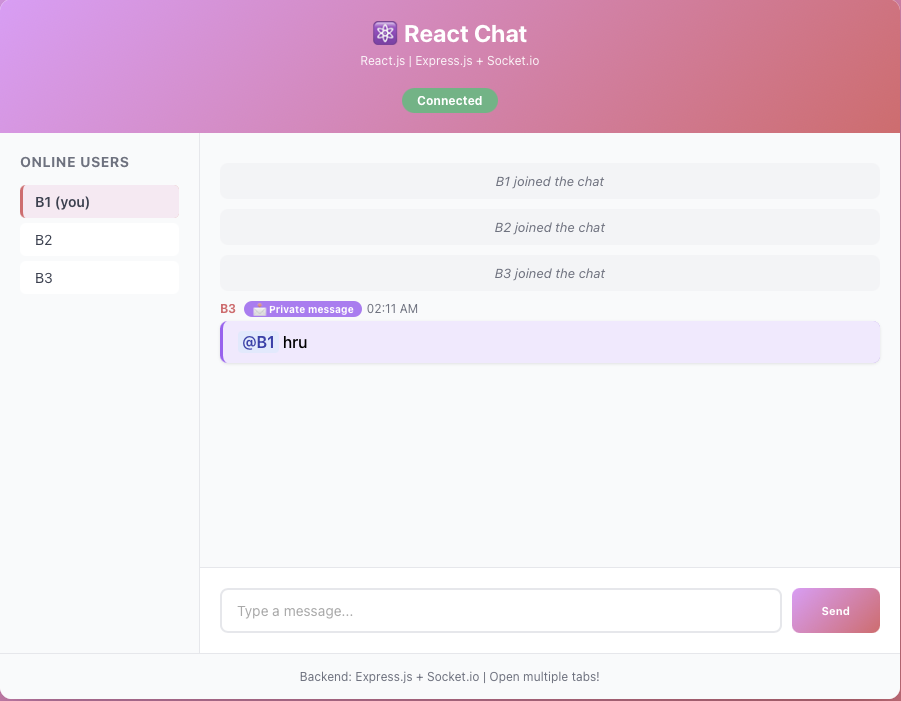
- ✅ Purple background indicating private message
- ✅ **"📩 Private message"** badge
- ✅ Shows sender "B3"
- ✅ Socket.io routing ensures privacy

**Backend Magic:**
- Vanilla: Manual `ws.send()` to specific WebSocket
- React: `socket.to(socketId).emit()` - ONE LINE!

---

### 3️⃣ React - Observer's View (B2)
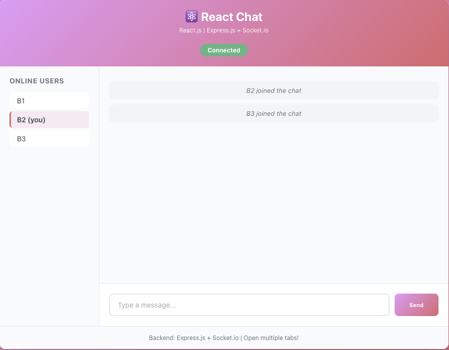
- ✅ **Message completely invisible to B2**
- ✅ Only sees system messages (users joining)
- ✅ Privacy maintained across Socket.io connections

**Why React is Faster:**
- **52% less code** than Vanilla (45 vs 95 lines)
- Socket.io abstractions eliminate boilerplate
- JSX makes conditional rendering trivial

---

## Angular Private Messaging Implementation 📩🅰️

**Scenario:** B3 sends `@B1 hi` as a private message in Angular Chat

### 1️⃣ Angular - Sender's View (B3)
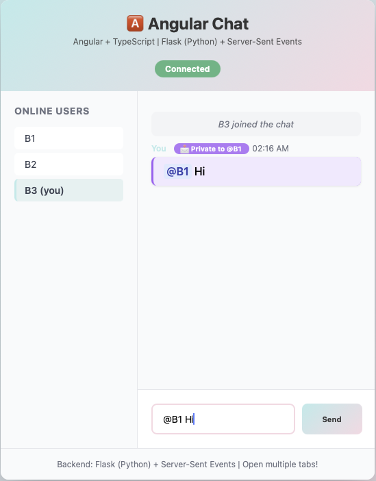
- ✅ Purple background (consistent across all frameworks)
- ✅ **"📩 Private to @B1"** badge
- ✅ Shows "You" as sender
- ✅ TypeScript type safety prevents bugs!

**Code Comparison:**
- Vanilla: Manual DOM with `createElement()`
- React: `{isDM && ...}` (JSX)
- Angular: `*ngIf="isDirectMessage(msg)"` (template directive)

---

### 2️⃣ Angular - Recipient's View (B1)
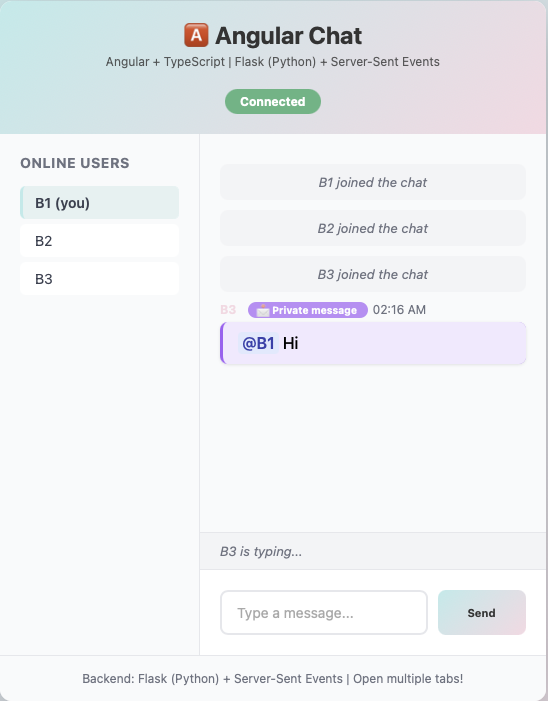
- ✅ Purple background indicating private message
- ✅ **"📩 Private message"** badge
- ✅ Shows sender "B3"
- ✅ SSE queue routing ensures privacy

**Backend Difference:**
- Vanilla/React: WebSocket/Socket.io (bidirectional)
- Angular: **Server-Sent Events** (unidirectional HTTP)
- Angular uses Python/Flask instead of Node.js!

---

### 3️⃣ Angular - Observer's View (B2)
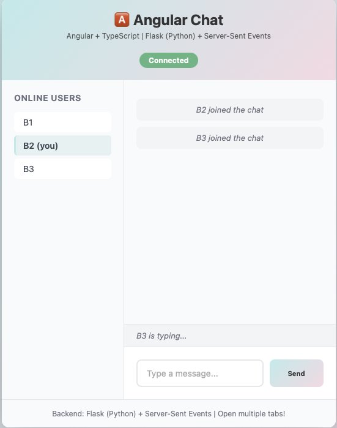
- ✅ **Message completely invisible to B2**
- ✅ Only sees system messages (users joining)
- ✅ Privacy maintained via SSE queue isolation

**Why Angular is Safer:**
- **TypeScript interface** forced PM property types at compile time
- **32% less code** than Vanilla (65 vs 95 lines)
- Template directives prevent XSS automatically
- Different backend tech stack (Python vs JavaScript)

---

## Comparison: Before vs After

### Before @Mention Feature:
- ❌ @mentions are plain text
- ❌ No way to know if you're mentioned
- ❌ No visual hierarchy
- ❌ All messages look the same

### After @Mention Feature:
- ✅ @mentions highlighted in blue within text
- ✅ Yellow background when you're mentioned
- ✅ Orange "@ mentioned you" badge (animated pulse)
- ✅ Clear visual feedback
- ✅ Easy to spot important messages

---

## 📊 Complete Framework Comparison - Private Messaging Feature

### Implementation Statistics (All Three Frameworks)

| Framework | Total Lines | Code Reduction | Time | Screenshots |
|-----------|-------------|----------------|------|-------------|
| **Vanilla JS** | 95 lines | Baseline (0%) | 25 min | ✅ 3 images |
| **React** | 45 lines | **-52%** 🏆 | **12 min** 🏆 | ✅ 3 images |
| **Angular** | 65 lines | **-32%** | 15 min | ✅ 3 images |

### Key Differences Across Frameworks

| Aspect | Vanilla | React | Angular |
|--------|---------|-------|---------|
| **Frontend Rendering** | Manual DOM (`createElement`) | JSX (`{isDM && ...}`) | Template (`*ngIf`) |
| **Backend Language** | JavaScript (Node.js) | JavaScript (Node.js) | **Python** (Flask) |
| **Protocol** | Raw WebSocket | Socket.io | **Server-Sent Events** |
| **State Management** | Manual variables | React Hooks | Angular Signals |
| **Type Safety** | ❌ None | ⚠️ Optional | ✅ Required (TypeScript) |
| **Security** | ⚠️ innerHTML risk | ✅ Auto-escape | ✅ Auto-sanitize |
| **User Finding** | Manual for loop | `Array.find()` | Python generator |
| **Message Routing** | `ws.send()` | `socket.to()` | `queue.put()` |

### Visual Consistency Across All Three

All implementations maintain consistent user experience:
- 🟣 **Purple background** (#f3e8ff) for private messages
- 🟡 **Yellow background** (#fef3c7) for public @mentions
- 📩 **DM badge** shows "Private to @user" or "Private message"
- 👁️ **Privacy guarantee**: Only sender and recipient see DMs

See [../PM_FEATURE_COMPARISON.md](../PM_FEATURE_COMPARISON.md) for detailed code analysis.

---

## How to Take New Screenshots

### For Vanilla (http://localhost:3001):
1. Open in Chrome/Firefox
2. Join as "B1"
3. Open another tab, join as "B2"
4. From B1, type: `@B2 hello there!`
5. **Screenshot B2's view** - should show yellow highlight + badge

### For React (http://localhost:3000):
1. Same process as above
2. Show typing indicator if possible
3. Show online users sidebar

### For Angular (http://localhost:4200):
1. Same process
2. Capture the teal/pink theme
3. Show SSE connection indicator

---

## Screenshot Guidelines

**Good Screenshots Should Show:**
- ✅ Full browser window with URL bar (proves it's running)
- ✅ Username modal (if capturing initial load)
- ✅ Online users sidebar with current user highlighted
- ✅ Multiple messages showing different states
- ✅ At least one message with @mention highlighting
- ✅ At least one message with "mentioned you" badge
- ✅ Clean, professional appearance

**Avoid:**
- ❌ Cut off UI elements
- ❌ Personal information in messages
- ❌ Empty chat windows
- ❌ Unclear or blurry screenshots
